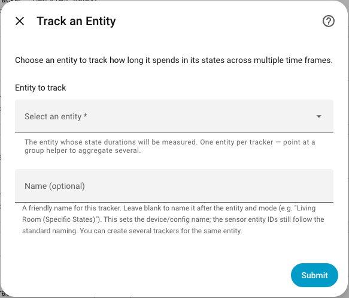
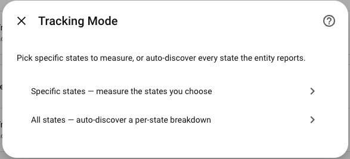
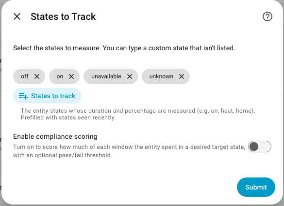
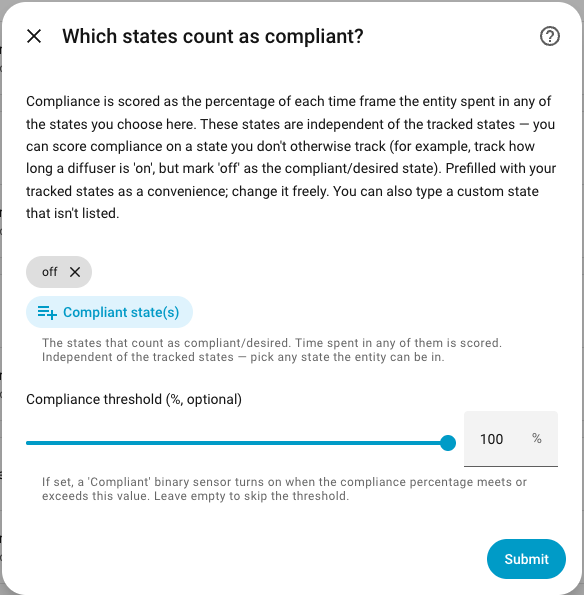
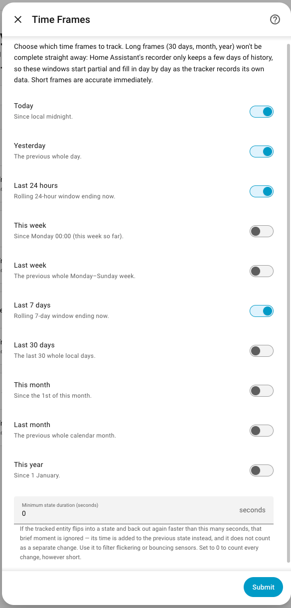
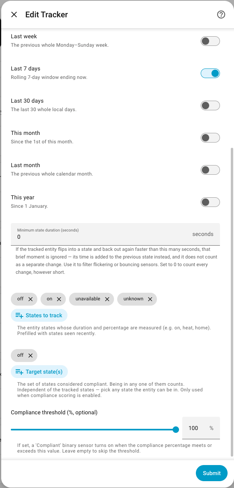
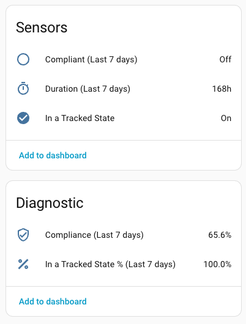
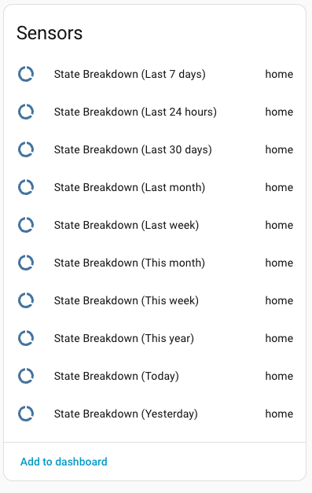
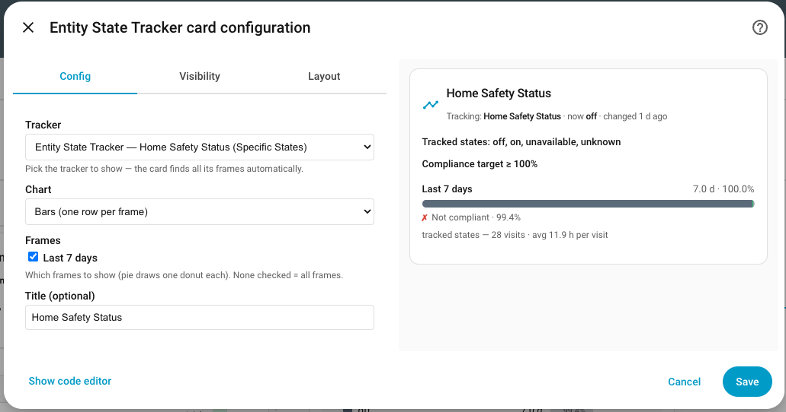
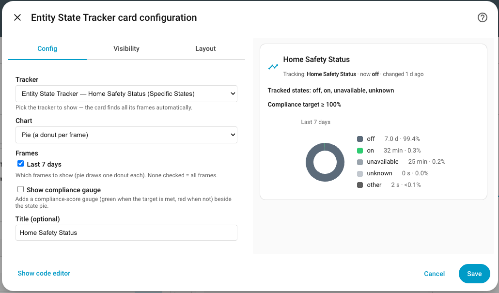

# Entity State Tracker for Home Assistant

<a href="https://github.com/italo-lombardi/Home-Assistant-EntityStateTracker/releases"></a>
<a href="https://github.com/hacs/integration"></a>
<a href="https://github.com/italo-lombardi/Home-Assistant-EntityStateTracker"></a>
<a href="https://www.home-assistant.io/"></a>
<a href="https://github.com/italo-lombardi/Home-Assistant-EntityStateTracker/blob/main/LICENSE"></a>

[](https://buymeacoffee.com/italolombardi)
[](https://paypal.me/ItaloLombardi)

[](https://my.home-assistant.io/redirect/hacs_repository/?owner=italo-lombardi&repository=Home-Assistant-EntityStateTracker&category=integration)
[](https://my.home-assistant.io/redirect/config_flow_start/?domain=entity_state_tracker)

**Track how long any entity spends in each of its states — across many time frames at once — and keep those numbers even after the recorder purges its history.**

Point Entity State Tracker at one entity, pick a mode, and it produces a bundle of duration, percentage, compliance, and transition sensors for `today`, `yesterday`, `24h`, `week`, `7d`, `30d`, `month`, and `year` — all from a single config-flow pick. It keeps its own persisted daily-bucket ledger, so a `30d`, `month`, or `year` window stays correct **past the recorder's ~10-day retention** instead of silently going incomplete. A custom Lovelace card renders it as bars, a pie/donut, or a dense multi-frame table.

---

## Features

- **Two modes, one config flow** — **specific-states** (pick the states you care about → duration + % + optional compliance score) or **all-states** (auto-discovers every state the entity visits → per-state breakdown). Choose from a menu; no YAML.
- **Many frames from one pick** — `today`, `yesterday`, `24h`, `week`, `7d`, `30d`, `month`, `year`. Toggle each on or off; the [Frames](#frames) table below notes which are calendar-aligned vs rolling.
- **Survives recorder purge** — a self-managed daily-bucket ledger (via HA `Store`) accumulates closed days, so long windows keep working past the recorder's default ~10-day retention. Data-since-date and gap flags mean a partial window is never silently wrong.
- **Compliance** (specific mode) — declare a *target* set of desired states (`heat` **or** `auto`), and the percentage becomes a compliance score with an optional threshold that spawns a `compliant` binary sensor.
- **Transitions** — per-state entry count, average visit duration, last-seen, and previous-state — riding the same event stream, near-zero extra machinery.
- **Auto-discovered breakdown** — all-states mode emits one breakdown sensor per frame whose attributes hold `breakdown_seconds`, `breakdown_pct`, `counts`, and `avg_duration_seconds` per state. A brand-new state at runtime just becomes a new key — no restart, no config change — and fires an `entity_state_tracker_new_state` event.
- **DST-correct** — every percentage uses the real elapsed seconds of the window as its denominator, so a 23-hour or 25-hour DST day still reads 100%.
- **Recorder-friendly** — the churny breakdown dicts are marked unrecorded; only sensor *states* record, and displayed values are rounded so idle ticks don't create history rows. Budgeted at ~250–400 KB/yr per tracker.
- **Custom Lovelace card** — bars, pie/donut, or table view; deterministic per-state colours; auto-installed as a Lovelace resource.
- **Survives HA restarts** — closed days persist in `.storage`; the open window is recomputed fresh from the recorder on start, with backfill for days missed while HA was down.

---

## Why Entity State Tracker (vs `history_stats`)

The only real equivalent for state-duration in Home Assistant is the native `history_stats` sensor — that is the baseline this integration is built to beat, and its block-accumulation algorithm is what we reuse rather than reinvent. Here is what Entity State Tracker adds:

| Gap | `history_stats` | Entity State Tracker |
|---|---|---|
| Frames per config | 1 window per YAML sensor | many frames from one config-flow pick |
| Value types | 1 (time **or** ratio **or** count) | duration + % + compliance + transition metrics together |
| Setup | hand-written YAML | config-flow UI |
| Required / target state | none | compliance % vs a declared target set |
| Windows > retention | silently incomplete past `purge_keep_days` (~10 d) | own persisted ledger survives purge |
| Auto-discover states | must pre-declare each | all-states mode discovers every state |

**No other custom integration fills this niche.** The closest HACS projects are downtime-only, single-cycle, or most-recent-state-only; none emit a *bundle* of multi-window duration / percent / breakdown sensors, and the all-states auto-discovered breakdown is a genuine gap that nothing built-in or on HACS covers (History and Logbook are timeline-only, with no numbers).

---

## Installation

### HACS (Recommended)

1. Open HACS in your Home Assistant instance.
2. Go to **Integrations** and click the three-dot menu.
3. Select **Custom repositories**.
4. Add `https://github.com/italo-lombardi/Home-Assistant-EntityStateTracker` with category **Integration**.
5. Click **Install** and restart Home Assistant.

### Manual

1. Download the [latest release](https://github.com/italo-lombardi/Home-Assistant-EntityStateTracker/releases).
2. Copy the `custom_components/entity_state_tracker/` folder into your `config/custom_components/` directory.
3. Restart Home Assistant.

---

## Configuration

This integration uses a config flow accessible from **Settings > Devices & Services > Add Integration > Entity State Tracker**. One entity per config entry — to aggregate across entities, point the tracker at a Home Assistant group helper (a group is an entity too).

### Step 1: Choose the entity

Select the single entity to track. Any entity works — a climate, a light, a lock, a person, a sensor. You can also give the tracker an optional friendly name here.



### Step 2: Choose the mode

A menu forks into one of two legs:

| Mode | What it does |
|------|--------------|
| **Specific states** | You pick the states to track. Produces duration + percentage sensors per frame, and — optionally — a compliance score against a target set. |
| **All states** | No state pick. Auto-discovers every state the entity visits and produces one per-state breakdown sensor per frame. |



### Step 2a: Specific-states leg

| Field | Description |
|-------|-------------|
| States to track | Multi-select, prefilled with the states already seen for this entity (current state + distinct recorder states, plus `unavailable` and `unknown`), case-normalised. Free entry allowed for states not yet seen. |
| Enable compliance | When on, adds a compliance step so the percentage becomes a *score* against a desired-state set. |



### Step 2a-i: Compliance (only when enabled)

| Field | Default | Description |
|-------|---------|-------------|
| Target states | — | The desired-state **set** — compliance counts time in *any* of these (`heat` **or** `auto`). Independent of the tracked states: you can score compliance on a state you don't otherwise track. |
| Target threshold (%) | *(optional)* | 0–100. When set, a `compliant` binary sensor turns on while today's compliance is at or above this threshold. |



### Step 2b: All-states leg

No state pick and no compliance — every state is discovered automatically.

### Shared tail (both legs)

| Field | Default | Description |
|-------|---------|-------------|
| Frames | `today`, `yesterday`, `24h`, `7d` on | Toggle each frame on or off. `week` is off by default to keep the default set lean; `30d`, `month`, and `year` are off by default because they exceed recorder retention and fill in over time via the ledger. |
| Minimum state duration (seconds) | `0` (disabled) | Glitch filter. Contiguous visits shorter than this merge into the preceding block, so momentary flaps don't count as real visits or inflate transition counts. |



### Options Flow

All settings can be edited after creation via **Settings > Devices & Services > Entity State Tracker > Configure**. Editing is **within-mode only** — changing the mode means creating a new tracker (a different mode produces a different output shape that would break existing consumers). Frame and target changes reload the entry automatically. Changing the glitch filter re-backfills the ledger so history reflects the new threshold.



---

## Sensors created

All entities attach to a per-tracker device (`Entity State Tracker — <label>`). The exact set depends on the mode.

### Specific-states mode

Per **enabled frame**, one **duration sensor**:

| Aspect | Value |
|--------|-------|
| State | Seconds spent in the tracked states during the frame (`device_class: duration`, unit seconds, suggested display in hours, 1 dp) |
| `state_class` | `measurement` |
| Key attributes | `source_entity`, `frame`, `percent`, `compliance_percent` and `target_threshold` (when a target is set), `tracked_states`, `target_states`, `window_start`, `data_start`, `window_coverage`, `has_gap`, plus transition metrics (`counts`, `avg_duration_seconds`, `previous_state`, `last_entered`, `last_exited`), and `duration_seconds`, `window_seconds`, `unaccounted_seconds` |

Per enabled frame, the **percent** — and, when a target set is configured, the **compliance percent** — also get their own standalone `%` sensors, so `numeric_state` triggers, history graphs, and long-term Statistics can bind to them directly (they also ride along as attributes on the duration sensor):

| Entity | Type | Notes |
|--------|------|-------|
| `sensor..._in_a_tracked_state_percent_<frame>` | Sensor | "In a Tracked State % (`<frame>`)". Share of the frame spent in the tracked states, `%`, `state_class: measurement`, diagnostic. One per enabled frame. |
| `sensor..._compliance_<frame>` | Sensor | "Compliance (`<frame>`)". Share of the frame spent in the **target** set, `%`, `state_class: measurement`, diagnostic. One per enabled frame, **only when a target set is configured**. |

For pass/fail automation, a **`compliant` binary sensor is created per enabled frame** when a threshold is set:

| Entity | Type | Notes |
|--------|------|-------|
| `binary_sensor..._compliant_<frame>` | Binary Sensor | `on` while **that frame's** compliance ≥ the target threshold (only when a threshold is set). One per enabled frame — e.g. `..._compliant_today`, `..._compliant_this_month` — each scoring its own window. |
| `binary_sensor..._in_a_tracked_state` | Binary Sensor | `on` while the entity is currently in one of the tracked states. Exposes `source_entity`, `tracked_states`, and `current_state` (the live matched state). |

Each `compliant` binary sensor also exposes `source_entity`, `compliance_percent`, `tracked_states`, `target_states`, `target_threshold`, `frame`, `data_start`, `window_coverage`, and `has_gap` as attributes, so you can see *why* it is on or off at a glance.

> **Frame note:** there is **one `compliant` sensor per enabled frame**, each scoring its own window against the same threshold — so a tracker with a threshold and `today`/`month` enabled exposes both "Compliant (Today)" (live-day compliance) and "Compliant (This month)" simultaneously. Pick the frame-suffixed entity for the window you care about; the window is also shown in each sensor's `frame` attribute.



### All-states mode

**One breakdown sensor per enabled frame** — not one sensor per state (that would leave a permanent registry orphan for every junk state the entity ever emitted). So four enabled frames means four sensors, and everything else lives in attributes:

| Entity | State | Attributes |
|--------|-------|------------|
| `sensor..._state_breakdown_<frame>` | The dominant (max-duration) state name for that frame | `source_entity`, `frame`, `breakdown_seconds` `{state: int}`, `breakdown_pct` `{state: float}`, `counts` `{state: int}`, `avg_duration_seconds` `{state: int}`, `previous_state`, `window_seconds`, `unaccounted_seconds`, `data_start`, `window_coverage`, `has_gap` |

- **Every state literal gets its own row** — `unavailable`, `unknown`, and `none` are counted as ordinary state names against a single wall-clock denominator, so the rows sum to ~100% of the covered window.
- **A new state seen at runtime becomes a new key**, accumulating from first-seen. No entity is created, no restart is needed. One INFO log line is written and an `entity_state_tracker_new_state` event always fires — automations can react to it with no extra configuration.
- The breakdown attributes are marked unrecorded (they change roughly every minute), so they never bloat the recorder — the ledger is the history store, and the card reads it live.



### Frames

Every duration/breakdown sensor exists per **enabled frame**:

| Frame | Kind | Window |
|-------|------|--------|
| `today` | calendar | local midnight → now |
| `yesterday` | calendar | previous local midnight → local midnight |
| `24h` | rolling | now − 24h → now |
| `week` | calendar | local Monday 00:00 → now (week-to-date) |
| `7d` | rolling | now − 7d → now |
| `30d` | rolling* | last 30 whole local days |
| `month` | calendar | 1st of the local month → now |
| `year` | calendar | Jan 1 local → now |

\* Windows longer than the recorder's retention can't be *truly* rolling (the tail day is no longer queryable), so `30d` is defined as "the last 30 whole local days" and labelled as such. `24h` and `7d` are true-rolling because they fit inside retention.

The `24h` and `7d` frames are computed from the **recorder** for accuracy: because their window starts mid-day, the recent portion is read from the recorder's real intra-day timeline rather than a whole-day ledger bucket (which would over-count the partial oldest day). The ledger only fills whole days older than the recorder covers. If you set recorder `purge_keep_days` below 7 days, the `7d` frame's oldest purged day falls back to whole-day ledger granularity for that single day — bounded and unavoidable, since daily-sum buckets carry no intra-day timeline.

---

## The Card

The integration ships a custom Lovelace card, auto-registered as a Lovelace resource when the integration loads. It offers three `chart:` view types:

- **Bars** (default) — a row per enabled frame with a percentage fill and a `6.2 h · 26%` label; a compliance ring/second bar when a target is set; a transition line (`opened 12× · avg 5 min`).
- **Pie / donut** — one frame's breakdown as slices (all-states) or in-state-vs-rest (specific mode). Each state gets a deterministic colour (hashed from the state name), so slices keep their colour as new states appear.
- **Table** — states as rows, frames as columns (duration + %), for a dense multi-frame dashboard view. Best fit for all-states with many frames.





Incomplete frames (where data is younger than the window) render hatched and labelled "since &lt;date&gt;". On YAML-mode dashboards, where Lovelace resources are read-only, the card degrades gracefully and logs manual-add instructions.

Add the card from the dashboard's **visual editor** and pick your tracker from the **Tracker** dropdown — it lists every Entity State Tracker by name. The card then discovers all of that tracker's frames and metrics itself, by device, so **you can freely rename any of the tracker's sensor entity IDs without breaking the card**.

```yaml
type: custom:entity-state-tracker-card
tracker_id: 01JABCXYZ...        # the tracker's config-entry id (visual editor fills this in)
chart: bars                     # bars | pie | table
```

The `tracker_id` is the tracker's config-entry id. You normally never type it by hand — the visual editor sets it for you. To find it manually, open the tracker under **Settings → Devices & Services → Entity State Tracker**; the id is the last path segment of the config-entry URL.

---

## Automation examples

See **[AUTOMATION_EXAMPLES.md](AUTOMATION_EXAMPLES.md)** for ready-to-adapt YAML covering every feature: `template` triggers on the today `percent` / `compliance_percent` attributes, reacting to the `compliant` and `in_a_tracked_state` binary sensors, catching new states via the `entity_state_tracker_new_state` event, reading `breakdown_pct` / `counts` / `avg_duration_seconds` off a breakdown sensor, and guarding on `has_gap` / `window_coverage` — plus Telegram/TTS channels and cooldown patterns.

---

## FAQ

**Q: How is this different from the built-in `history_stats` sensor?**
A: `history_stats` gives you one window, one value type, per hand-written YAML sensor, and it silently goes incomplete once your window exceeds recorder retention. Entity State Tracker bundles many frames, duration + percent + compliance + transitions, from a single UI pick, and keeps a persisted ledger so long windows stay correct. See the [Why](#why-entity-state-tracker-vs-history_stats) table.

**Q: Does it need the Recorder?**
A: It uses the recorder to compute recent windows (within retention) and to backfill after a restart, so the recorder is expected. If the recorder is disabled, the integration falls back to live-only accumulation (no backfill), raises a Repair issue, and keeps working for the frames it can.

**Q: My `30d` / `month` / `year` sensor shows less than a full window. Why?**
A: Those frames start off, and when you enable one it only has data from that point forward (plus whatever the recorder still holds, up to ~10 days). The ledger fills the rest in over time. Until it does, the sensor reports a partial window and flags it via `data_start` / `has_gap` / a "since &lt;date&gt;" label — it is never silently wrong.

**Q: What happens to my numbers across a daylight-saving change?**
A: They stay correct. Every percentage divides by the real elapsed seconds of the window, not a fixed 86,400, so a 23-hour or 25-hour DST day still reads 100% for a continuously-in-state entity.

**Q: A new state appeared on my all-states tracker. Do I need to restart?**
A: No. A previously-unseen state just becomes a new key in the breakdown attributes, accumulating from the moment it was first seen. An `entity_state_tracker_new_state` event fires so you can react to it.

**Q: What happens after a Home Assistant restart?**
A: Closed days persist in `.storage` and survive the restart. The open window is recomputed fresh from the recorder, and days missed while HA was down are backfilled from recorder history where available.

**Q: Why doesn't editing a tracker let me switch its mode?**
A: Specific-states and all-states produce different sets of entities. Switching mode in place would change the output shape and break any card, automation, or dashboard consuming it. Create a new tracker instead — the ledger survives structurally.

---

## Contributing

Contributions are welcome! Please:

1. Fork the repository.
2. Create a feature branch (`git checkout -b feature/my-feature`).
3. Commit your changes with clear commit messages.
4. Open a Pull Request against `main`.

### Running Tests

```bash
python -m pytest tests/ -v
```

The test suite enforces 100% line **and** branch coverage.

---

## Sibling Integrations

Other Home Assistant integrations by the same author:

| Integration | Description |
|-------------|-------------|
| [Entity Availability](https://github.com/italo-lombardi/Home-Assistant-EntityAvailability) | Monitor entity availability — offline detection, uptime %, MTBF/MTTR, battery and signal health, with a custom card |
| [Entity Guard](https://github.com/italo-lombardi/Home-Assistant-EntityGuard) | Enforces entity state via declarative rules — replaces hand-written auto-off, auto-lock, and kill-switch automations |
| [Entity Distance](https://github.com/italo-lombardi/Home-Assistant-EntityDistance) | Tracks distance between 2–5 HA entities (persons, devices, zones) — direction, speed, ETA, proximity, group sensors |
| [Fuel Compare](https://github.com/italo-lombardi/Home-Assistant-FuelCompare) | Tracks live fuel prices from 36 providers across 30 countries |
| [WashWise](https://github.com/italo-lombardi/Home-Assistant-WashWise) | Decide whether to wash your car, bike, or solar panels — or skip garden irrigation — based on the weather forecast |
| [DashSnap](https://github.com/italo-lombardi/DashSnap) | Record or screenshot any web page via headless Chromium — HA dashboards, Grafana, public pages |
| [DashSnap Integration](https://github.com/italo-lombardi/DashSnap-Integration) | Trigger DashSnap recordings and screenshots from HA automations and scripts — exposes `dashsnap.record_ha` and `dashsnap.record` services |

---

## Disclaimer

This is an unofficial integration and is not affiliated with, endorsed by, or supported by the Home Assistant project or the Open Home Foundation.

---

## License

This project is licensed under the GNU General Public License v3.0. See the [LICENSE](LICENSE) file for details.
